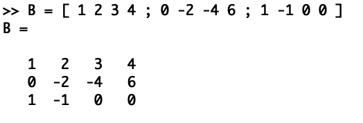
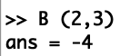
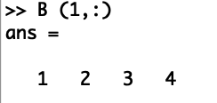
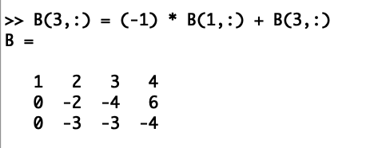
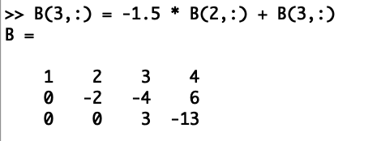
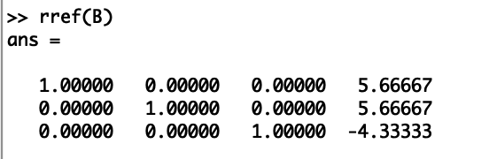
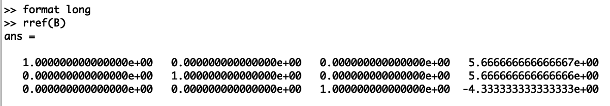
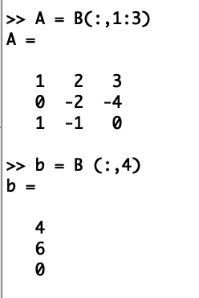
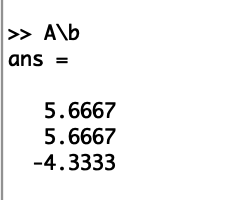
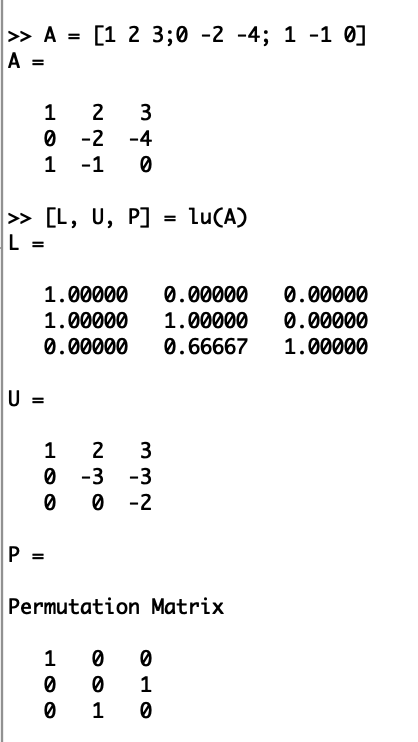

## РОССИЙСКИЙ УНИВЕРСИТЕТ ДРУЖБЫ НАРОДОВ  
### Факультет физико-математических и естественных наук  
### Кафедра прикладной информатики и теории вероятностей  

#### ОТЧЕТ ПО  
#### ЛАБОРАТОРНОЙ РАБОТЕ №4  
#### ПО ТЕМЕ:  
#### Матрицы и линейные системы  

*дисциплина: Научное программирование*  

Студент: Хиссен Али Уэддей   
Группа: НПМмд-02-20  
Ст. билет № 1032209306  

**Цель работы**  
Рассмотрение системы линейных уравнений, подгонка полиномиальной кривой и матричные преобразования.

**Ход работы**  
**1. Метод Гаусса**  
Octave содержит сложные алгоритмы, встроенные для решения систем
линейных уравнений.  
Для решения системы линейных уравнений:  
Ax = b  
методом Гаусса можно построить расширенную матрицу вида  
B = (A|b).  
Рассмотрим расширенную матрицу. (см. Fig.1)  

  
Fig.1 Расширенная матрица  

Ее можно просматривать поэлементно. (см. Fig.2)  

  
Fig.2 Поэлементное просматривание матрицы  

Это скаляр, хранящийся в строке 2, столбце 3.  
Также можно извлечь целый вектор строки или вектор столбца, используя оператор сечения. Сечение можно использовать для указания ограниченного диапазона. Если не указано начальное или конечное значение, то результатом оператора является полный диапазон. (см. Fig.3)  

  
Fig.3 Вектор строки  

Реализуем теперь явно метод Гаусса.  
Сначала добавим к третьей строке первую строку, умноженную на −1. (см. Fig.4)  

  
Fig.4 Преобразование матрицы шаг 1  

Далее добавим к третьей строке вторую строку, умноженную на −1.5. (см. Fig.5)  

  
Fig.5 Преобразование матрицы шаг 2  

Матрица теперь имеет треугольный вид. Очевидным образом получим ответ:  
5.66667; 5.66667; -4.33333  
Этот ответ был получен путем решения третьей строки матрицы, а впоследствии подставлением найденных элементов в другие строки матрицы. Либо этот ответ можно получить приведя матрицу к единичной(треугольной), цифры справа это и есть ответ.  

Конечно, Octave располагает встроенной командой для непосредственного поиска треугольной формы матрицы. (см. Fig. 6)  

  

Fig.6 Получение единичной матрицы  

**2. Формат записи чисел**  
Следует обратить внимание, что все числа записываются в виде чисел с плавающей точкой (то есть десятичных дробей). Пять десятичных знаков отображаются по умолчанию. Переменные на самом деле хранятся с более высокой точностью, и при желании можно отобразить больше десятичных разрядов. (см. Fig. 7)  

  
Fig.7 Более высокая точность записи десятичного числа  

**3. Левое деление**  
Встроенная операция для решения линейных систем вида Ax = b в Octave называется левым делением и записывается как A\b. Выделим из расширенной матрицы B матрицу A. (см. Fig.8)  
Также выделим вектор b. (см. Fig.8)  

  
Fig.8 Выделение матрицы и вектора  

После чего найдём вектор x. (см. Fig. 10)  

  
Fig.9 Вектор x  

**4. LU разложение**

LU разложение – это вид факторизации матриц для метода Гаусса. Цель состоит в том, чтобы записать матрицу A в виде  
A = LU,  
где L – нижняя треугольная матрица, а U – верхняя треугольная матрица. Эта факторизованная форма может быть использована для решения уравнения Ax = b.  
LU-разложение существует только в том случае, когда матрица A обратима, а все главные миноры матрицы A невырождены. Этот метод является одной из разновидностей метода Гаусса.  

Решение систем линейных уравнений  

Если известно LU-разложение матрицы A, то исходная система может быть записана как:  
LUx = b.  
Эта система может быть решена в два шага. На первом шаге решается система:  
Ly = b.  
Поскольку L – нижняя треугольная матрица, эта система решается непосредственно прямой подстановкой.  

На втором шаге решается система:  
Ux = y.  
Поскольку U – верхняя треугольная матрица, эта система решается непосредственно обратной подстановкой.  
Задание: 
Пусть дана матрица A. (см. Fig.10)  
С помощью Octave нужно расписать её LU-разложение.  
Распишем LU-разложение матрицы A (см. Fig.10)  

  
Fig.10 LU-разложение матрицы  

**Вывод**  
В ходе выполнения данной работы я научилась работать с системами линейных уравнений, с подгонкой полиномиальной кривой и с матричными преобразованиями, а также я научилась производить LU- разложение матриц.

