## РОССИЙСКИЙ УНИВЕРСИТЕТ ДРУЖБЫ НАРОДОВ  
### Факультет физико-математических и естественных наук  
### Кафедра прикладной информатики и теории вероятностей  

#### ОТЧЕТ ПО  
#### ЛАБОРАТОРНОЙ РАБОТЕ №5  

*дисциплина: Научное программирование*  

Студент: Хиссен Али Уэддей   
Группа: НПМмд-02-20  
Ст. билет № 1032209306

**Цель работы**  
Ознакомление с некоторыми операциями в среде Octave для решения таких задач, как подгонка полиномиальной кривой, матричных преобразований, вращений, отражений и дилатаций.

**Ход работы**  
**Подгонка полиномиальной кривой**  
В статистике часто рассматривается проблема подгонки прямой линии
к набору данных. Решим более общую проблему подгонки полинома к
множеству точек. Пусть нам нужно найти параболу по методу наименьших квадратов для набора точек, заданных матрицей  

$$
D =
\left(
\begin{array}{cc}
1 & 1 
\\ 
2 & 2 
\\
3 & 5
\\
4 & 4
\\
5 & 2
\\
6 & -3
\end{array}
\right)
$$

В матрице заданы значения $x$ в столбце 1 и значения $y$ в столбце 2.
Введём матрицу данных в Octave и извлечём вектора $x$ и $y$. Данные операции показаны на Рис. 1.
  
Рис.1 Ввод матрицы данных  

Нарисуем точки на графике, см. Рис. 2.  

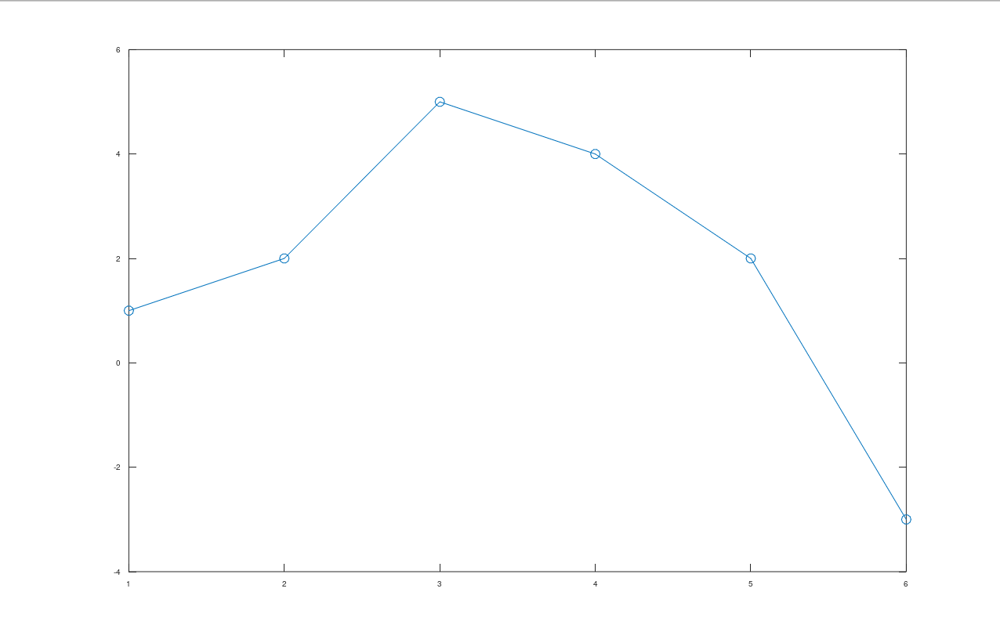  
Рис.2 Нанесение точек на плоскость  

Построим уравнение вида $y = ax^2 + bx + c$. Подставляя данные,
получаем следующую систему линейных уравнений.  

$$
\left(
\begin{array}{ccc}
1 & 1 & 1
\\ 
4 & 2 & 1
\\
9 & 3 & 1
\\
16 & 4 & 1
\\
25 & 5 & 1
\\
36 & 6 & 1
\end{array}
\right)
\left(
\begin{array}{c}
a
\\ 
b
\\
c
\end{array}
\right)
=
\left(
\begin{array}{c}
1
\\ 
2
\\
5
\\
4
\\
2
\\
-3
\end{array}
\right).
$$  

Обратим внимание на форму матрицы коэффициентов $A$. 
Третий столбец – все единицы, второй столбец – значения $x$, а первый столбец – квадрат значений $x$. 
Правый вектор – это значения $y$. Есть несколько способов
построить матрицу коэффициентов в Octave. Один из подходов состоит в том, чтобы использовать команду ones для создания матрицы единиц соответствующего размера, а затем перезаписать первый и второй столбцы необходимыми данными. Это показано на  Рис. 3.

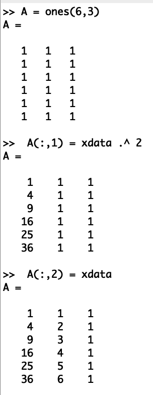  
Рис.3 Создание матрицы А  

Решение по методу наименьших квадратов получается из решения уравнения $A^T Ab = A^T b$, где $b$ – вектор коэффициентов полинома.
Используем Octave для построения уравнений, как показано на  Рис. 4

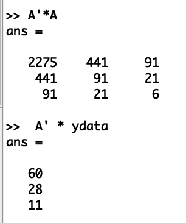  
Рис.4 Построение уравнений по методу наименьших квадратов  

Решим задачу методом Гаусса (См. Рис.5). Для этого запишем расширенную матрицу:

$$
B =
\left(
\begin{array}{cccc}
2275 & 441 & 91 & 60 
\\ 
441 & 91 & 21 & 28 
\\
91 & 21 & 6 & 11
\end{array}
\right).
$$  

Таким образом, искомое квадратное уравнение имеет вид

$$
y = -0.89286 x^2 + 5.65 x - 4.4
$$  

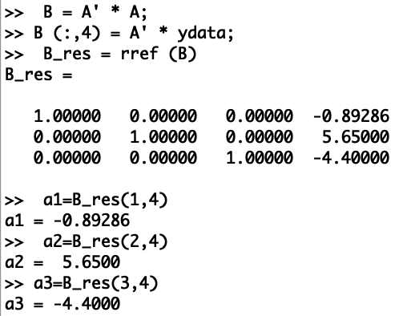  
Рис.5 Решение задачи методом Гаусса  

После чего построим соответствующий график параболы. Построение можно увидеть на Рисунке 6, а вид самой параболы на рисунке  7.

  

Рис.6 Построение графика параболы  

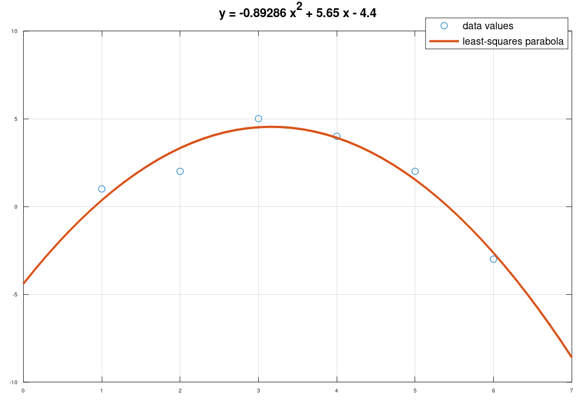  

Рис.7 График параболы  

Процесс подгонки может быть автоматизирован встроенными функциями Octave. Для этого мы можем использовать встроенную функцию
для подгонки полинома polyfit. Синтаксис: polyfit (x, y, order),
где order – это степень полинома. Значения полинома P в точках, задаваемых вектором-строкой x можно получить с помощью функции polyval.
Синтаксис: polyval (P, x).

На рисунке 8 получим подгоночный полином.  

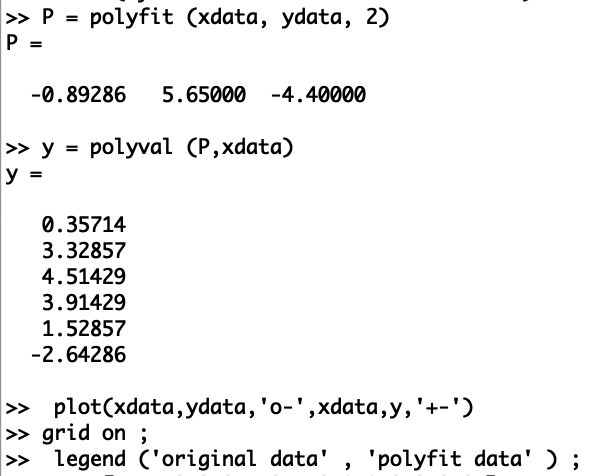  

Рис.8 Подгоночный полином  

После чего рассчитаем значения в точках и построим исходные данные. Это показано на Рис.9.  

  

Рис.9 Граф исходных и подгоночных данных  

**Матричные преобразования**  
Матрицы и матричные преобразования играют ключевую роль в компьютерной графике. Существует несколько способов представления изображения в виде матрицы. Подход, который мы здесь используем, состоит в том, чтобы перечислить ряд вершин, которые соединены последовательно, чтобы получить ребра простого графа. Мы записываем это как матрицу $2 \times n$, где каждый столбец представляет точку на рисунке. В качестве простого примера, давайте попробуем закодировать граф-домик. Есть много способов закодировать это как матрицу. Эффективный метод состоит в том, чтобы выбрать путь, который проходит по каждому ребру ровно один
раз (цикл Эйлера).  

$$
D =
\left(
\begin{array}{ccccccc}
1 & 1 & 3 & 3 & 2 & 1 & 3
\\ 
2 & 0 & 0 & 2 & 3 & 2 & 2
\end{array}
\right).
$$  

Реализация показана на рисунке 10.

  

Рис.10 Реализация построения графа  

Полученный граф можно увидеть на рисунке 11.  

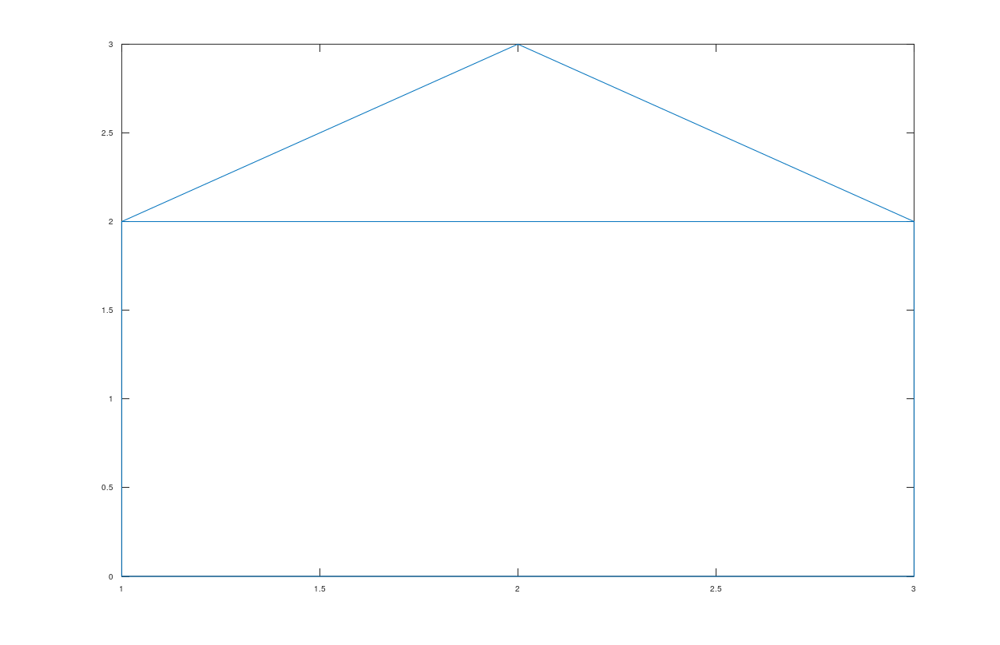  

Рис.11 Полученный граф.  

**Вращение**  
Рассмотрим различные способы преобразования изображения. 
Вращения могут быть получены с использованием умножения на специальную матрицу. Вращение точки $(x, y)$ относительно начала координат определяется как  

$$
R
\left(
\begin{array}{c}
x
\\ 
y
\end{array}
\right),
$$

где

$$
R =
\left(
\begin{array}{cc}
cos(\theta) & -sin(\theta)
\\ 
sin(\theta) & cos(\theta)
\end{array}
\right),
$$  

$\theta$ - угол поворота (измеренный против часовой стрелки).

Теперь, чтобы произвести повороты матрицы данных $D$, нам нужно
вычислить произведение матриц $RD$. Повернём граф дома на $90^{\circ}$ и $225^{\circ}$. Вначале переведём угол в радианы. Произведенные действия показаны на рисунках 12 - 14.  

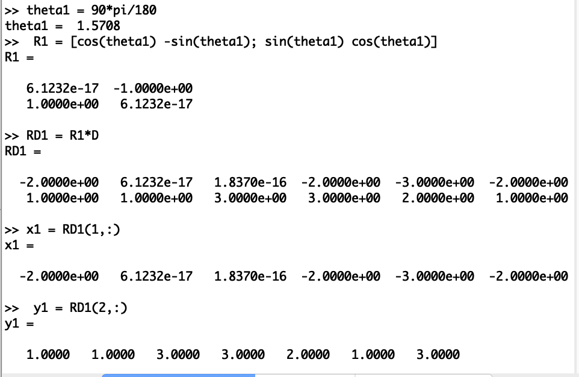  

Рис.12 Поворот на 90 градусов  

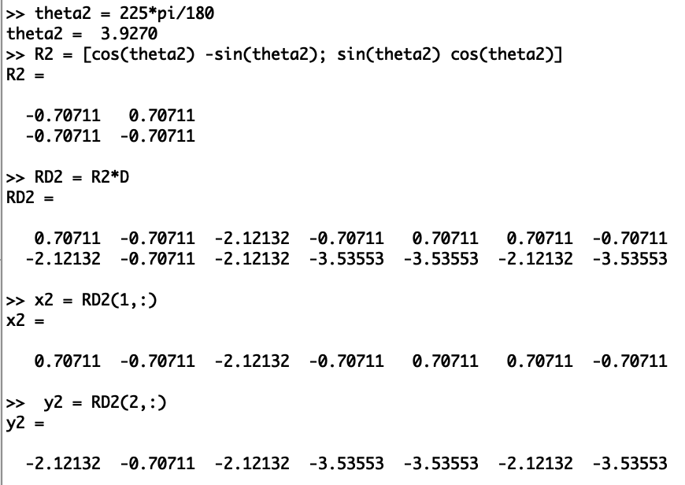  

Рис.13 Поворот на 225 градусов  

  

Рис.14 Результаты вращения  

**Отражение**  

Если $l$ – прямая, проходящая через начало координат, то отражение точки
$(x, y)$ относительно прямой $l$ определяется как

$$
R
\left(
\begin{array}{c}
x
\\ 
y
\end{array}
\right),
$$

где

$$
R =
\left(
\begin{array}{cc}
cos(2\theta) & sin(2\theta)
\\ 
sin(2\theta) & -cos(2\theta)
\end{array}
\right),
$$

$\theta$ - угол между прямой $l$ и осью абсцисс (измеренный против часовой
стрелки).
Отразим граф дома относительно прямой $y = x$. Зададим матрицу
отражения, как показано на рисунке 15.

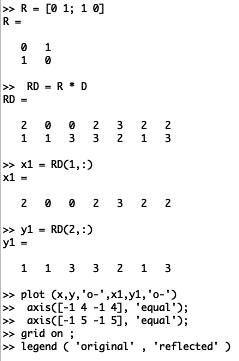  

Рис.15 Задание отражения  

Далее на рисунке 16 показано, какой результат получился в ходе этих действий.  

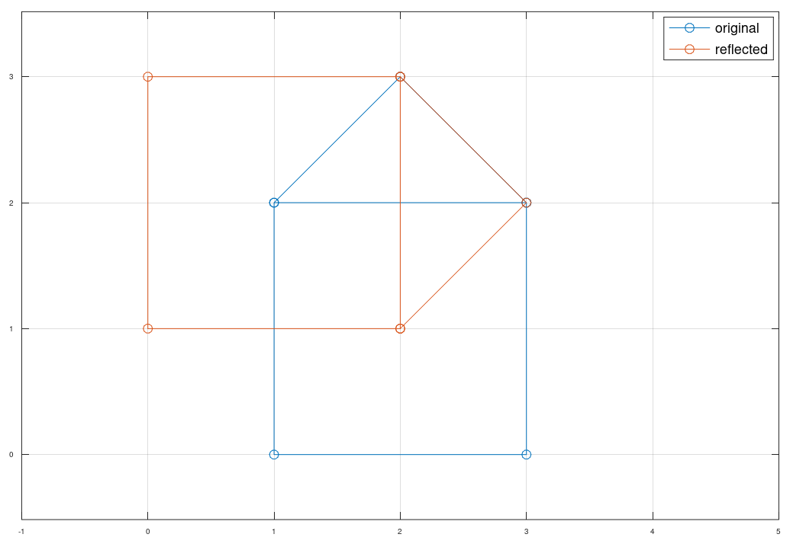  

Рис.16 Результат отражения  

**Дилатация**  

Дилатация (то есть расширение или сжатие) также может быть выполнено путём умножения матриц. Пусть  

$$
T =
\left(
\begin{array}{cc}
k & 0
\\ 
0 & k
\end{array}
\right),
$$  

Тогда матричное произведение $TD$ будет преобразованием дилатации
$D$ с коэффициентом $k$.
Увеличим граф дома в 2 раза. Реализация выполнена на Рисунке 17.  

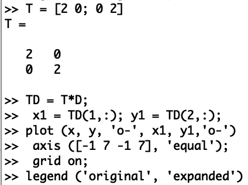  

Рис.17 Реализация дилатации  

После чего на рисунке 18 можно увидеть результат данной операции.  

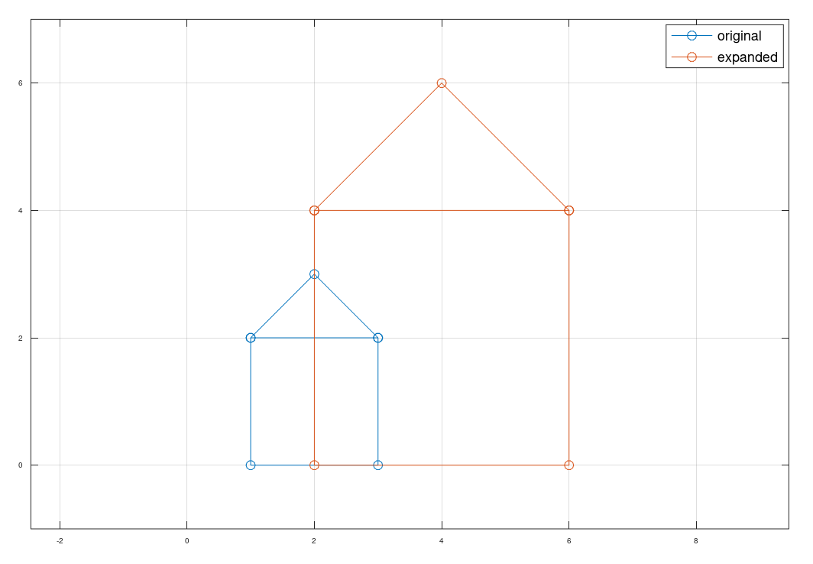  

Рис.18 Результат увеличения  

**Вывод**  
В ходе выполнения данной работы я ознакомилась с некоторыми операциями в среде Octave для решения таких задач, как подгонка полиномиальной кривой, матричных преобразований, вращений, отражений и дилатаций.