## РОССИЙСКИЙ УНИВЕРСИТЕТ ДРУЖБЫ НАРОДОВ  
### Факультет физико-математических и естественных наук  
### Кафедра прикладной информатики и теории вероятностей  

#### ОТЧЕТ ПО  
#### ЛАБОРАТОРНОЙ РАБОТЕ №3  
#### ПО ТЕМЕ:  
#### Введение в работу с Octave  

*дисциплина: Научное программирование*  

Студент: Хиссен Али Уэддей  
Группа: НПМмд-02-20  
Ст. билет № 1032209306

**Постановка задачи**  
Ознакомление с некоторыми операциями в Octave.  

**Ход работы**  
**1. Простейшие операции**  
Включим журналирование сессии.  
  
Листинг 1  
Продемонстрируем, что Octave можно использовать как простейший калькулятор. Для этого вычислим выражение  
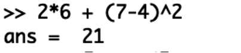  
Листинг 2  
Зададим вектор  
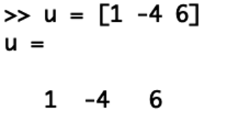  
Листинг 3  
Зададим ковектор  
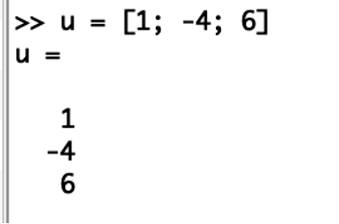  
Листинг 4  
Зададим матрицу  
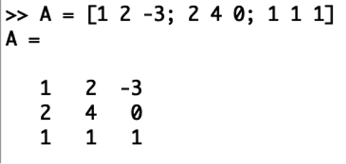  
Листинг 5  
**2. Операции с векторами**  
Зададим два вектор-столбца  
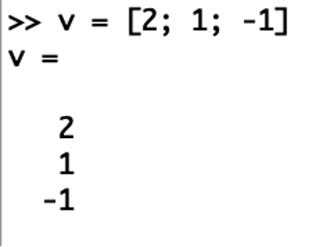
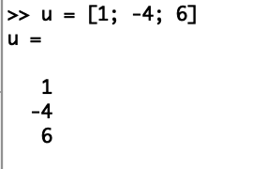  
Листинг 6  
Выполним операции сложения векторов  
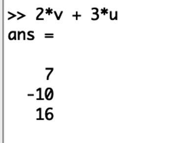  
Листинг 7  
Скалярное умножение  
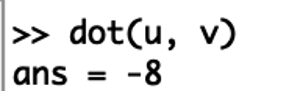  
Листинг 8  
Векторное умножение  
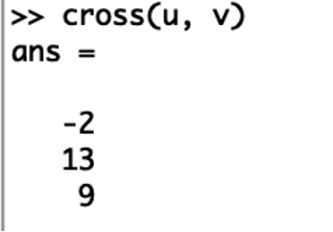  
Листинг 9  
Вычислим норму вектора  
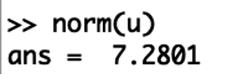  
Листинг 10  
**3. Вычисление проектора**  
Введём два вектора-строки  
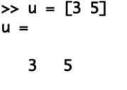
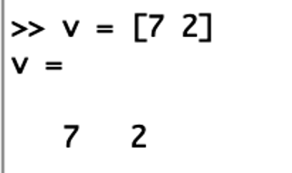  
Листинг 11  
Вычисоим проекцию вектора u на вектор v  
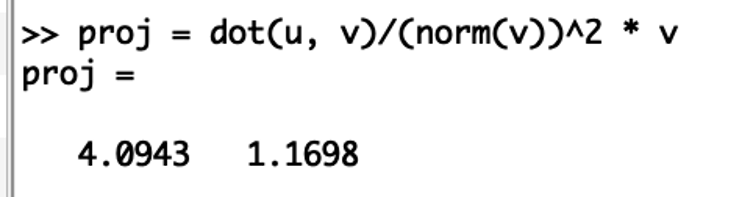  
Листинг 12  
**4. Матричные операции**  
Введем матрицы Â и B̂.  
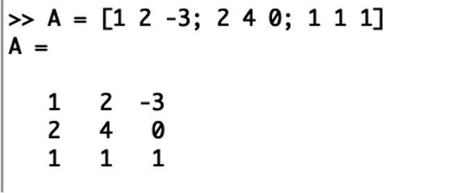
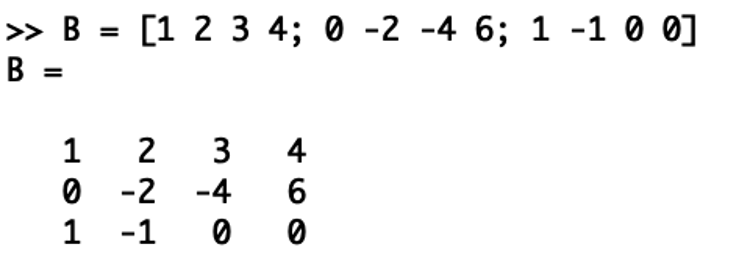  
Листинг 13  
Вычислим произведение матриц ÂB̂  
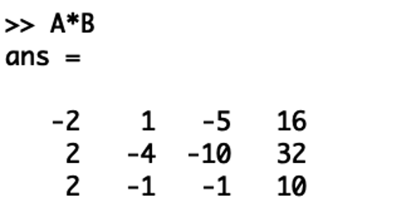  
Листинг 14  
Вычислим произведение матриц B̂^T^Â.  
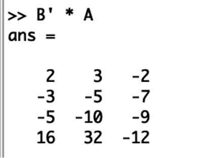  
Листинг 15  
Вычислим 2Â − 4Î, где Î есть единичная матрица.  
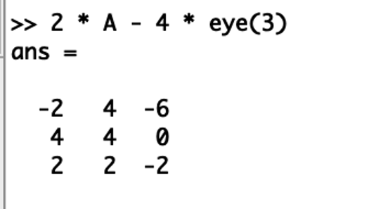
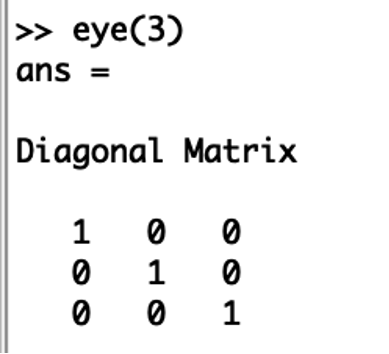  
Листинг 16  
Найдем определитель | Â |  
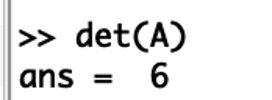  
Листинг 17  
Найдем обратную матрицу Â^−1^  
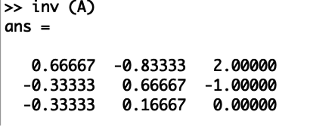  
Листинг 18  
Найдем собственные значения матрицы  
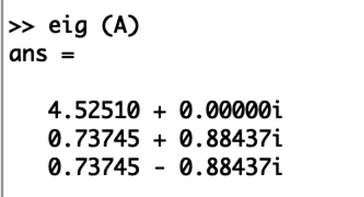  
Листинг 19  
Вычислим ранг матрицы  
  
Листинг 20  
**5. Построение простейших графиков**  
Построим график функции sin 𝑥 на интервале [0, 2π]. Создадим вектор значений 𝑥  
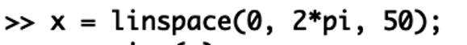  
Листинг 21  
Зададим вектор 𝑦 = sin 𝑥  
  
Листинг 22  
Построим график  
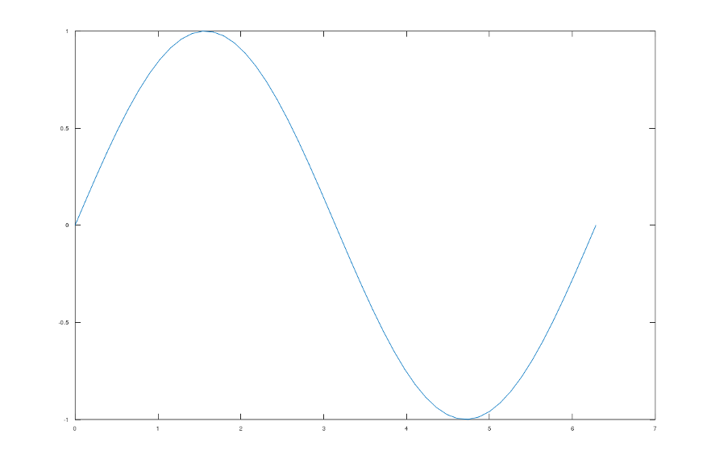  
Листинг 23  
Улучшим внешний вид графика. Сначала очистим получившийся график, заметим, что заданные вектора 𝑥 и 𝑦 сохранились.  
  
Листинг 24  
Зададим красный цвет для линии и сделаем её потолще  
  
Листинг 25  
Подгоним диапазон осей  
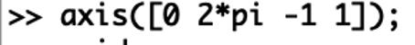  
Листинг 26  
Нарисуем сетку  
  
Листинг 27  
Подпишем оси  
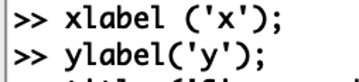  
Листинг 28  
Сделаем заголовок графика и зададим легенду  
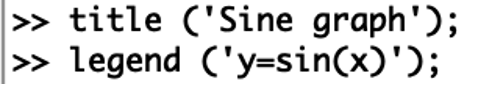  
Листинг 29  
**6. Два графика на одном чертеже**  
Начертим два графика на одном чертеже. Очистим память и рабочую область фигуры  
  
Листинг 30  
Зададим два вектора  
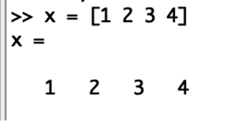
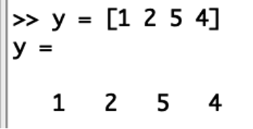  
Листинг 31  
Начертим эти точки, используя кружочки как маркеры.  
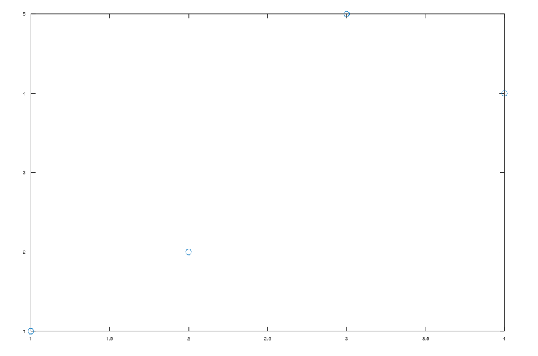  
Листинг 32  
Чтобы добавить к нашему текущему графику ещё один, нужно использовать команду hold on. Добавим график регрессии  
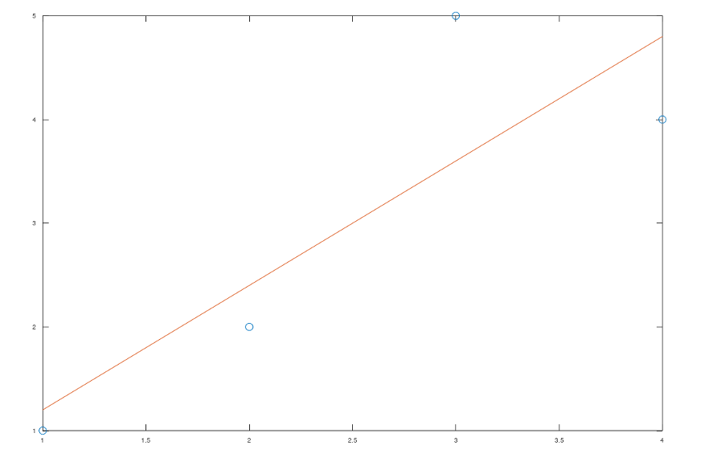  
Листинг 33  
Зададим сетку, оси и легенду.  
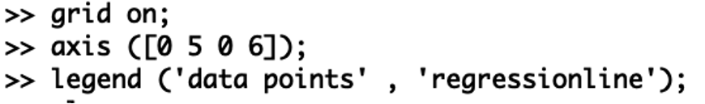  
Листинг 34  
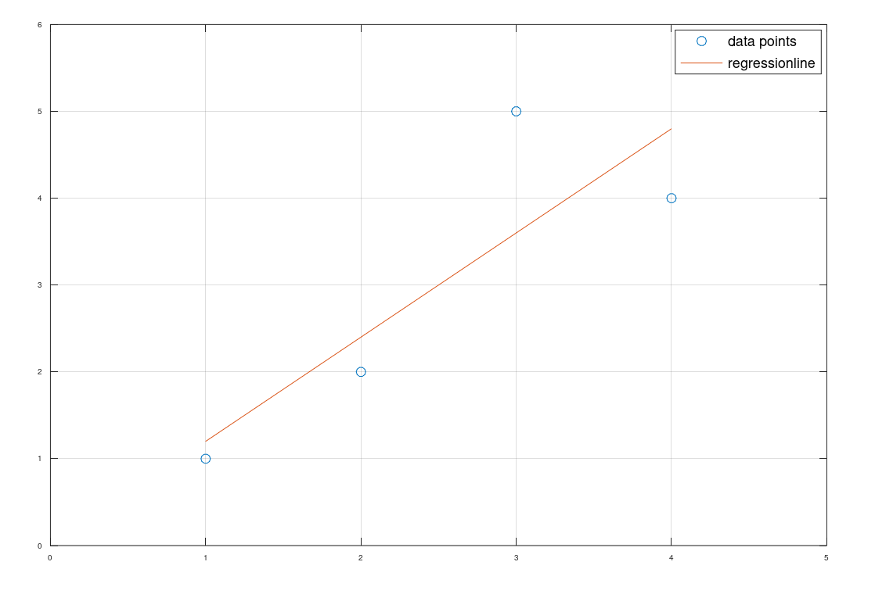  
Листинг 35  
**7. График y=x^2^ sin x**  
Очистим память и рабочую область фигуры
Зададим вектор x.  
  
Листинг 36  
Построим график y=x^2^ sin x, используя поэлементное возведение в степень .^ и поэлементное умножение .*.  
  
Листинг 37  
Сохраним графики в виде файлов.  
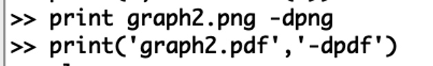  
Листинг 38  
**8. Сравнение циклов и операций с векторами **  
Сравним эффективность работы с циклами и операций с векторами. Для этого вычислим сумму:  
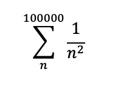  
Очистим память и рабочую область фигуры
Вычислим сумму с помощью цикла, создадим файл loop_for.m, функции tic и toc служат для запуска и остановки таймера  
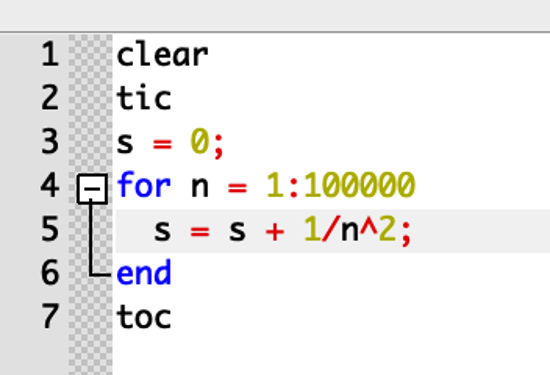  
Листинг 39  
Запустим файл loop_for.m.  
  
Листинг 40  
Вычислим сумму с помощью операций с векторами.
Создадим файл loop_vec.m, запустим его.  
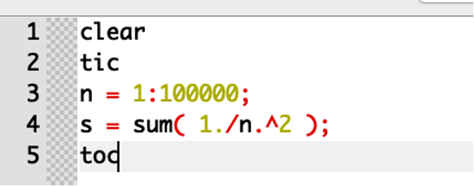  
Листинг 41  
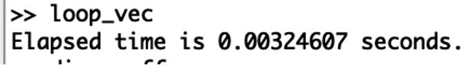  
Листинг 42  
 Завершим запись в файл.  
  
Листинг 43  

**Вывод**  
Таким образом, мы ознакомились с некоторыми простейшими операциями в Octave.

