#РОССИЙСКИЙ УНИВЕРСИТЕТ ДРУЖБЫ НАРОДОВ
##Факультет физико-математических и естественных наук
###Кафедра прикладной информатики  теории вероятностей
#### ОТЧЕТ ПОЛАБОРАТОРНОЙ РАБОТЕ №6 
##### ТЕМЕ: Задача на собственные значение 

#####дисциплина: Научное программирование
Студент: Хиссен Али Уэддей
Группа: НПМмд-02-20
Ст. билет № 10322090306
Постановка задачи
######ВЫИСЛЕНИЕ ПРИДЕЛЫ
**Литинсг 1**
Включеине журналирование сессии

вычислим придел данной последовательность в octave

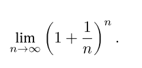

**Литинсг 2**

выводим фукцию в octave

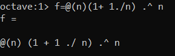

**Литинсг 3**
Далее создаем вектор столбца который индикс начинается от 0 до 9  и потом возьмем n как n=10^k^ 

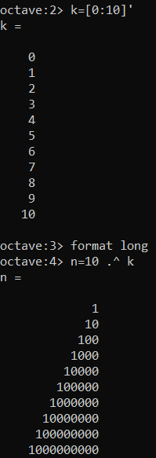

**Литинсг 4**

затем оценим значение  f(n)  при увеличение n

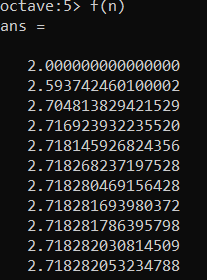

не трудно заметить что при увеличении n ,придел сходиться к конечному значению кторый приблизительно равно 2,7128

###вычисление частичные суммы 

**Литинсг 5**

выислим частичные суммы для следующее вырожение 

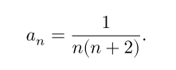

для заданных значеных n  получим :

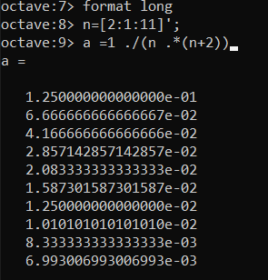

**Литинсг 6**

вычисление частичных сумм

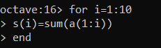

**Литинсг 7**

**Литинсг 8**

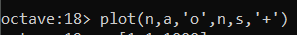

Нарисуем график слагаемые и частичные суммы 

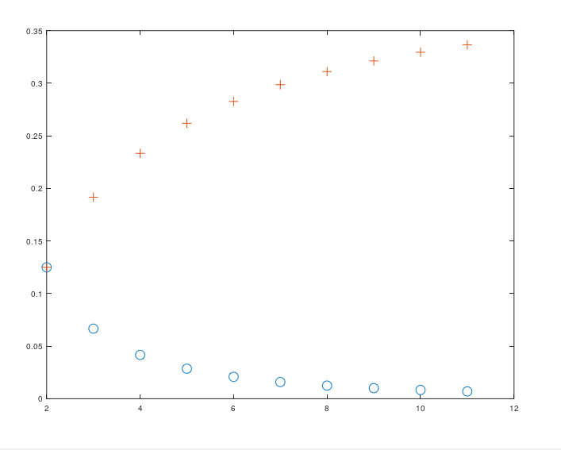

###Вычисление суммы ряда
вычислим сумму превые 1000 членов гормонического ряда. 

**Литинсг 9**
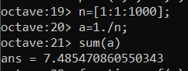

##Численные интегрирование 

#### вычисление интегралов

**Литинсг 10**

вычислим интеграл  от 

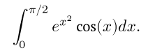

для этого используем команда quad('f',a,b).
Определим функцую и затем вычислим интеграл.

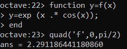

## Аппроксимирование суммами 

**Литинсг 11**

для предидущего интеграла, вычислим интеграл по правило средней точки для n=100
для этого напишем следующий скрипт 

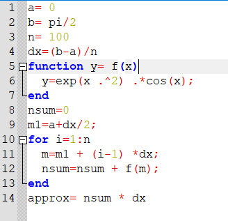

результат выпольнения скрипта в командной строки 

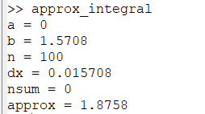

напишем тот же код но без цикла так как octave является векторным языком 

**Литинсг 12**

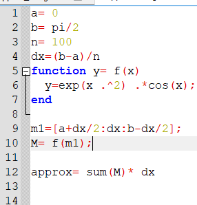

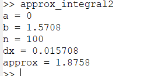

**Литинсг 13**

сравним результаты измеряя время выпольнения двух скриптов 

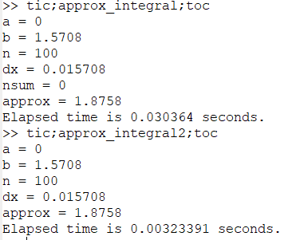

можно заметить что при использованни второй метод, сприпт работает достаточно быстро, т.е 10 быстрее.

**Литинсг 14**

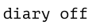

вывод: так мы знакомились с способом выисления приделы,интегралов, частычные суммы ,суммы  и аппроксимации в octave.

