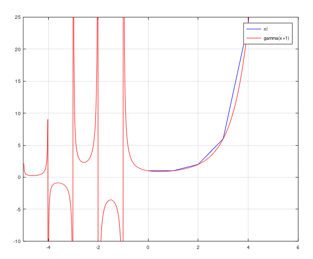

#РОССИЙСКИЙ УНИВЕРСИТЕТ ДРУЖБЫ НАРОДОВ
##Факультет физико-математических и естественных наук
###Кафедра прикладной информатики  теории вероятностей
#### ОТЧЕТ ПОЛАБОРАТОРНОЙ РАБОТЕ №7 
##### ТЕМЕ: Задача на собственные значение 

#####дисциплина: Научное программирование
Студент: Хиссен Али Уэддей
Группа: НПМмд-02-20
Ст. билет № 10322090306
Постановка задачи
Ознакомление с некоторыми графиками.
Включеине журналирование сессии

####параметрические графики 
посторим график трих периодов  циклоиды радиуца 2.
 ,

**Литинсг 1**

определим t как вектор в диапозоне от **0 до 6pi**
и затем вычислим x и y.
 
 

**Литинсг 2**
нарисуем график 

**Литинсг 3**
в полярный системи кардинат  ,используем стандарное преобразование координат и затем гфафиг на осях ху.

**Литинсг 4**

**Литинсг 5**
так можно постройт график функцию в полярных системы координат используя команду **polar**

**Литинсг 6**
сдесь можно увидет результаты выпольнения команды

### график неявных функции 

**Литинсг 7**
можно построит график неявных фунции вида 

выводим функцую и порсстроим ее график с помошью команду ezplot
**Литинсг 8**

**Литинсг 9**
Нарисуем окружность радиуса 5 т центра в точке (2,0)
зададим функцую в виде ламбда функции

**Литинсг 10**
построим окружность 

**Литинсг 11**

найдем уравнение касатель к окружностью в точке А(-1,4) и затем построим касатель к окружности .

**Литинсг 12**

### комплексные  числа

**Литинсг 13**
выводим две комплексные число и выпольным основные арифметические операции 

**Литинсг 14**

можно так же построить в комплексной плоскости используя комвнду compass

**Литинсг 15**
график в комплексной плоскости 

###Cпециальные функции
В осtave существует много специальных функций.
построим грвфик гамма фукций и n! на одном графике поскольку для натуральных числа n, гамма фукция удовлетворяет соотношению 

**Литинсг 16**
построим грвфик гамма (x+1) и n!

не служно увидеть вертикальные асимптоты на графике в районе отрицательных целых чицел,

**Литинсг 17**
нарусуем более точный график разделая область значений на отдельные интервалы

**Литинсг 18**

таким образом получим следующий график.
 

выклучение журналирование

вывод: таким образом мы знакомлись с способами построенями некоторыми графиками  в octave