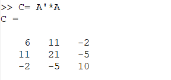

#РОССИЙСКИЙ УНИВЕРСИТЕТ ДРУЖБЫ НАРОДОВ
##Факультет физико-математических и естественных наук
###Кафедра прикладной информатики и теории вероятностей
#### ОТЧЕТ ПОЛАБОРАТОРНОЙ РАБОТЕ №8 
##### ТЕМЕ: Задача на собственные значение 

#####дисциплина: Научное программирование
Студент: Хиссен Али Уэддей
Группа: НПМмд-02-20
Ст. билет № 10322090306
Постановка задачи
Ознакомление с некоторыми операциями в Octave.
Включеине журналирование сессии

**Литинсг 1**
выводим матрицу А для вычисления собственных значении и собственных векторов.

для нохождения используется кoманда eig с двумя выходными аргументами 

**Литинсг 2**

Превый элемент результата есть матрица, столбцы которой представляют собственные векторы, а второй диагональная матрица с собственные значение на диагонали .

получим матрицу с действительными собственными значенями ,для это умножим матрицу на транспонированную матрицу.

**Литинсг 3**

Воспользуем предидущую команду для нохождения собственных значении и собственных векторов

**Литинсг 4**

###Случайные блуждание 
найдем вектор вероятьность после 5 шагов для каждого следующего начального вектора.
матрица переходов имеет вид

**Литинсг 5**

Начальные векоторы вероятьность 

**Литинсг 6**

Для заданных следующих начальных условыя,
векторы верояность после 5 шагов имеют вид:

**Литинсг 7**

Найдем вектор равновесного состояния для цепи Маркова с следующей переходной матрицей.

**Литинсг 8**

Если х является собственным вектором для **Lambda =1** с неотрицательнымим компонентами, сумма равна 1, то х является вектором равновесным состоянием для Т.
Найдем х

**Литинсг 9**

Проверим что оно является равновесным состояикм для Т, то есть при умножении матрицу на вектор х получится вектор х. 

**Литинсг 10**

выклучение журналирование

**Литинсг 11**

